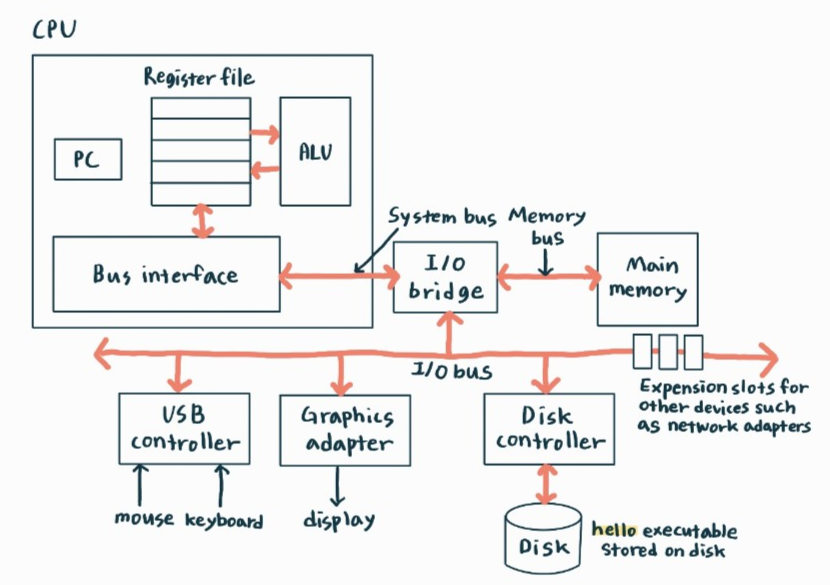
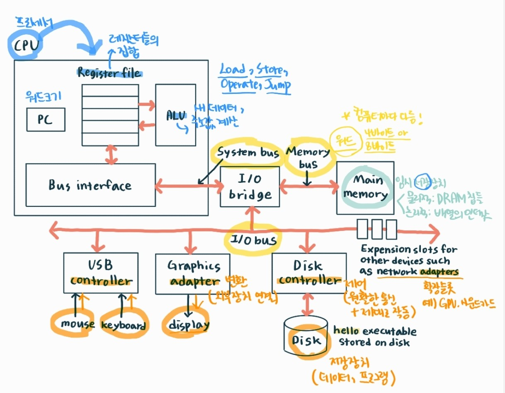
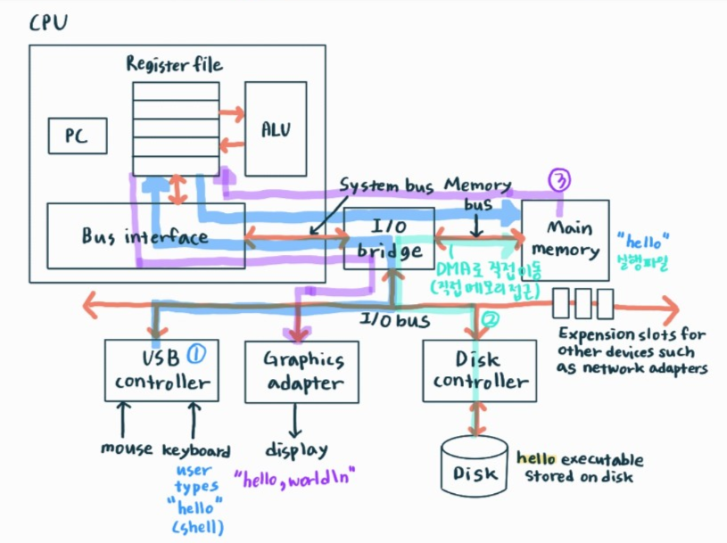

# 2025-03-15 : 알고리즘/컴퓨터 시스템/JavaScript

오늘은 알고리즘, 컴퓨터 시스템, JavaScript를 공부했다. 각각 공부한 시간은 다음과 같다.

- 알고리즘: 7시간

- 컴퓨터 시스템: 3시간

- JavaScript: 1시간

## 💙 1. 알고리즘

어느정도 감은 잡혔다. 다만 백트래킹은 월요일에 오래 잡고 공부해야 할 것 같다. 오늘 푼 문제들은 다음과 같다.

> 10989, 2751, 2309, 1181, 2750, 10872, 2628, 1065, 9020, 1978, 2908, 1152, 2675, 11654, 15596, 2577 (총 16문제)

## 💙 2. [CSAPP] Ch1. 컴퓨터 시스템으로의 여행

### 🔶 1.4 프로세서는 메모리에 저장된 인스트럭션을 읽고 해석한다

#### 😶 용어 정리

> **커맨드라인 인터프리터**
>
> ✅ 사용자가 텍스트 기반 명령어를 입력하면 이를 해석하고 실행하는 프로그램
> 
> 커맨드라인 인터프리터로는는 Bash, Zsh, PowerShell, cmd.exe가 있다.

#### 😶 내용 정리

지금까지 *hello.c* 소스 프로그램은 컴파일 시스템에 의해 hello라는 실행가능한 목적파일로 번역되어 디스크에 저장되었다. 이 실행파일을 유닉스 시스템에서 실행하기 위해서 쉘이라는 응용프로그램에 그 이름을 입력한다.

```shell
linum > ./hello
hello, world
linux >
```

쉘은 **커맨드라인 인터프리터**로 프롬프트를 출력하고 명령어 라인을 입력 받아 그 명령을 실행한다. 쉘은 내장되어 있는 쉘 명령어가 아니면 실행 파일의 이름이라고 판단하고, 그 파일을 로딩해서 실행시킨다.

### 🔶 1.4.1 시스템의 하드웨어 조직

#### 😶 용어 정리

> **전기적 배선군**
>
> ✅ 여러 개의 전기 배선을 특정한 규칙에 따라 그룹화한 것
> 
> 전기 배선(와이어, 케이블)은 전력을 공급하거나, 신호를 전달하는 역할을 하는데, 이런 전기 배선을 기능, 전압, 신호 종류 등에 따라 특정한 그룹으로 묶은 배선 집합을 전기적 배선군이라고 한다.

> **컨트롤러/어댑터**
> 
> 컨트롤러와 어댑터는 컴퓨터 시스템에서 하드웨어 장치 간의 데이터 전송을 관리하는 역할을 하는 부품이지만, 기능과 사용 방식에서 차이가 있다.
> 
> ✅ 컨트롤러: 하드웨어의 동작을 제어하고 데이터 흐름을 관리하는 장치
> 
> ✅ 어댑터: 하드웨어 간의 연결을 돕거나 변환하는 장치
>
> 컨트롤러는 디바이스 자체가 칩셋이거나 시스템의 인쇄기판(머더보드)에 장착되는 반면, 어댑터는 머더보드의 슬롯에 장착되는 카드이다. (어댑터: 아래 이미지 슬롯 참조)

#### 😶 내용 정리
아래는 전형적인 시스템이 구성되어 있는 하드웨어 조직도이다. hello 프로그램을 실행할 때 하드웨어에서는 어떤 일이 일어날까?



위의 사진의 버스(I/O bus, Memory bus, System bus), 입출력 장치(mouse, keyboard, display, disk), 메인 메모리(main memeory), 프로세서(CPU)에 대해 차례대로 설명하겠다.



- **버스(buses)**
  
  사진에는 빨간색 연결선이 존재한다. 이렇게 시스템 내를 관통하는 **전기적 배선군**을 버스라고 하며, 컴포넌트들 간에 바이트 정보들을 전송하는 역할을 한다. 버스는 일반적으로 워드(word)라고 하는 고정 크기의 바이트 단위로 데이터를 전송하도록 설계된다. 워드의 크기는 시스템(컴퓨터 아키텍처)에 따라 다르다. 오늘날 대부분의 컴퓨터들은 4바이트(32비트)나 8바이트(64비트) 워드 크기를 갖는다.

- **입출력 장치**
  
  사진의 마우스, 키보드, 디스플레이, 디스크가 입출력 장치이다. 마우스와 키보드는 입력을, 디스플레이는 출력을, 그리고 디스크 드라이브는 데이터와 프로그램의 장기 저장을 담당한다(실행가능 파일인 hello 프로그램은 디스크에 저장되어 있다). 각 입출력 장치는 입출력 버스와 **컨트롤러**나 **어댑터**를 통해 연결되며, 정보를 주고받을 수 있다.

- **메인 메모리**
  
  메인 메모리는 프로세서가 프로그램을 실행하는 동안 데이터와 프로그램을 저장하는 임시 저장 장치다. 메인 메모리는 물리적으로 DRAM(Dynamic Random Access Momory) 칩들로 구성되어 있고, 논리적으로 메모리는 연속적인 바이트들의 배열이며 각각 0부터 시작해서 고유의 주소(배열의 인덱스)를 가지고 있다.

- **프로세서**
  
  주처리장치(CPU)라고도 부른다. 이 프로세서는 메인 메모리에 저장된 인스트럭션들을 해독(실행)하는 엔진이다.

  - **PC(프로그램 카운터)**
  
    프로세서의 중심에 있는 워드 크기의 저장장치(register)이다. CPU가 프로그램을 실행하는 동안, PC는 메모리의 특정 위치를 가리킨다. 이 위치에는 기계어(Instruction)가 저장되어 있으며, CPU는 이를 가져와 해석하고 실행한다. 이 과정은 시스템에 전원이 공급되는 순간부터 전원이 끊어질 때까지 반복적으로 진행된다.

  - **레지스터 파일**
  
    각각 고유의 이름을 갖는 워드 크기의 레지스터 집합으로 구성되어 있다.

  - **ALU(수식/논리 처리기)**
  
    새 데이터와 주소 값을 계산한다.

  다음은 인스트럭션 요청에 의해 CPU가 실행하는 단순한 작업의 예이다.

  - 적재(Load): 메인 메모리에서 레지스터에 한 바이트 또는 워드를 이전 값에 덮어쓰는 방식으로 복사한다.
  - 저장(Store): 레지스터에서 메인 메모리로 한 바이트 또는 워드를 이전 값을 덮어쓰는 방식으로 복사한다.
  - 작업(Operate): 두 레지스터의 값을 ALU로 복사하고 두 개의 워드로 수식연산을 수행한 뒤, 결과를 덮어쓰기 방식으로 레지스터에 저장한다.
  - 점프(Jump): 인스트럭션 자신으로부터 한 개의 워드를 추출하고, 이것을 PC에 덮어쓰기 방식으로 복사한다.

### 🔶 1.4.2 hello 프로그램의 실행

프로그램이 하드웨어에서 실행되는 단계는 아래 이미지와 같다.

1. hello 명령어를 키보드에서 읽어들이는 과정
2. 실행파일을 디스크에서 메인 메모리로 로딩하는 과정
3. 출력 스트링을 메모리에서 화면으로 기록하는 과정



## 💙 3. JavaScript

우선 생활코딩의 *WEB2 JavaScript* 강의로 공부할 계획이다.
### 🔶 4. HTML과 JS의 만남: 이벤트

```HTML
<!DOCTYPE html>
<html>
    <head>
        <meta charset="utf-8">
        <title></title>
    </head>
    <body>
        <input type="button" value="hi" onclick="alert('hi')">
        <input type="text" onchange="alert('changed')">
        <input type="text" onkeydown="alert('keydown!')">
    </body>
</html>
```

onclick, onchange, onkeydown 얘네를 이벤트라고 한다.

### 💡 느낀 점!

공부는 꾸준하게!!!