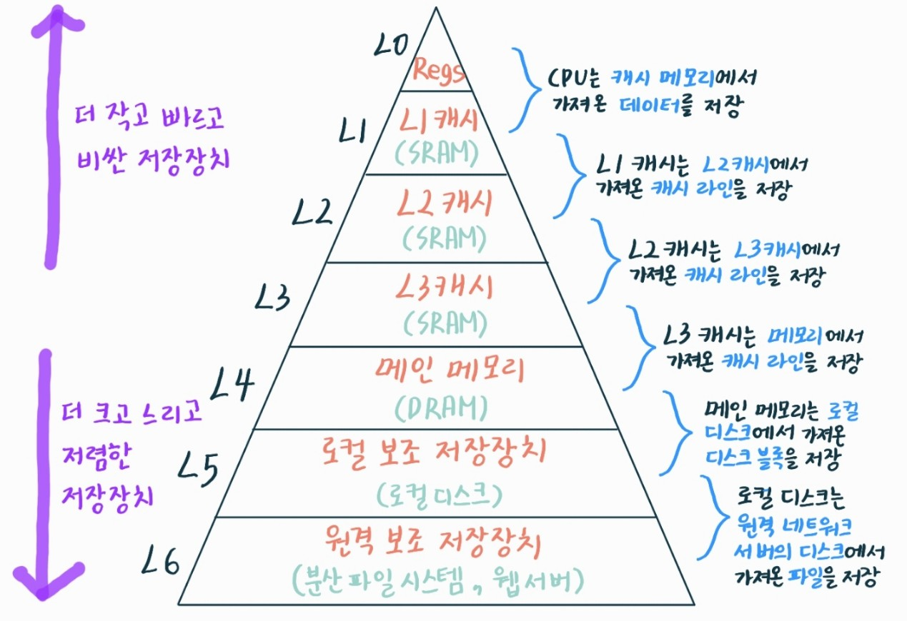

# 2025-03-15 : 알고리즘/컴퓨터 시스템

### 💡 오늘의 목표!

1. 자바스크립트 ES6+ 기초 핵심 문법: 6~9강 공부하기 (❌)
2. 1074 Z(⭕), 1914 하노이탑 다시 풀어보고(⭕), 9663 N-Queen(⭕), 10819 차이를 최대로(❌) 문제 풀
3. 백트래킹 공부하기 (❌)
4. CSAPP 1-5, 1-6 읽기 (⭕)
5. 인턴 기업 분석하기 (❌)

## 💙 1. [CSAPP] Ch1. 컴퓨터 시스템으로의 여행
 
### 🔶 1.5 캐시가 중요하다.

#### 📌 프로그램 실행 과정

프로그램이 동작하기 전까지는 로딩(Loading)과 실행(Execution) 두 단계가 존재한다.

- 로딩(Loading)
  
  프로그램을 실행하기 전에, 하드디스크(저장장치)에 있는 실행 파일을 메모리(RAM)로 불러오는 과정이다. 로딩이 완료되어야 프로그램을 실행할 준비가 되는 것이다.

- 실행(Execution)
  
  프로그램이 로딩된 후, CPU가 인스트럭션을 하나씩 실행하면서 동작하는 과정이다.

*hello 프로그램*의 기계어 인스트럭션들은 본래 하드디스크에 저장되어 있다가, 프로그램이 **로딩**될 때 메인 메모리로 복사된다. 프로세서가 프로그램을 **실행**할 때 인스트럭션들은 메인 메모리에서 프로세서로 복사된다.

프로그래머의 관점에서, 이러한 여러 복사 과정들이 프로그램의 "실제 작업"을 느리게 하는 오버헤드다. 그래서 시스템 설계자들의 주요 목적은 이러한 복사과정들을 가능한 한 빠르게 동작하도록 하는 것이다.

#### 📌 저장 장치의 크기, 속도, 비용 관계

다음은 저장 장치의 크기와 속도, 그리고 비용의 상관관계이다.

✅ 더 빠른 장치들은 더 느린 장치들보다 만드는 데 더 많은 비용이 든다.

✅ 더 큰 저장장치들은 보다 작은 저장장치들보다 느린 속도를 갖는다.

> 예시 1) 디스크 드라이브는 메인 메모리보다 일반적으로 1,000배 더 크다. 하지만 프로세서가 디스크에서 1워드의 데이터를 읽어들이는 데 걸리는 시간은 메모리에서보다 천만 배 더 오래 걸릴 수 있다.

> 예시 2) 일반적인 레지스터 파일은 수백 바이트의 정보를 저장하는 반면, 메인 메모리의 경우는 십억 개의 바이트를 저장한다. 그러나 프로세서는 레지스터 파일의 데이터를 읽는 데 메모리의 경우보다 거의 100배 더 빨리 읽을 수 있다.

여기서 예시 2에서 문제가 나타난다. 반도체 기술이 매년 발달함에 따라 *프로세서-메모리* 간 격차가 지속적으로 증가하고 있기 때문이다. 메인 메모리를 더 뻐르게 동작하도록 만드는 것보다 프로세서를 더 빨리 동작하도록 만드는 것이 더 쉽고 비용이 적게 든다.

#### 📌 캐시(Cache) 메모리

프로세서-메모리 간 격차를 해결하기 위해 작고 빠른 저장장치인 캐시 메모리(간단히 캐시)가 등장했다. 캐시는 프로세서는 단기간에 필요로 할 가능성이 높은 정보를 임시로 저장하는 역할을 한다.

✅ 캐시 계층 구조

1. L1 캐시
   
   프로세서 칩 내에 들어있다. 대략 수천 바이트의 데이터를 저장할 수 있으며, 거의 레지스터 파일만큼 빠른 속도로 엑세스할 수 있다.

2. L2 캐시
   
   L1 캐시보다 조금 더 크다. 수백 킬로바이트에서 수 메가 바이트의 용량을 가지며 프로세서와 전용 버스를 통해 연결된다. 메인 메모리를 엑세스할 때보다는 5배에서 크게는 10배까지 더 빠르다. 다만 L1캐시보다 5배 정도 느리다.

3. L3 캐시
   
L1 캐시와 L2 캐시는 SRAM(Static Random Access Memory)이라는 하드웨어 기술을 이용해 구현한다. 보다 새롭고 보다 강력한 시스템은 3단계의 캐시를 갖는 경우도 있다. (L1, L2, L3) 프로그램은 특정 데이터와 코드를 반복적으로 사용하는데, 이를 지역성이라고 한다. 자주 액세스할 가능성이 높은 데이터를 캐시가 보관하도록 설정하면, 대부분의 메모리 작업을 빠른 캐시에서 수행할 수 있다.

### 🔶 1.6 저장장치들은 계층구조를 이룬다.

모든 컴퓨터 시스템의 저장장치들은 아래와 같은 메모리 계층구조로 구성되어 있다.

계층의 꼭대기에서부터 맨 밑바닥까지 이동할수록 저장장치들은 더 느리고, 더 크고, 바이트당 가격이 싸진다. 메모리 계층구조의 주요 아이디어는 한 레벨의 저장장치가 **다음 하위레벨 저장장치의 캐시 역할**을 한다는 것이다. L1과 L2의 캐시는 각각 L2와 L3의 캐시이다. L3 캐시는 메인 메모리의 캐시이고, 이 캐시는 디스크의 캐시 역할을 한다. 일부 분산 파일시스템을 가지는 네트워크 시스템에서 로컬 디스크는 다른 시스템의 디스크에 저장된 데이터의 캐시 역할을 수행한다. 로컬디스크들은 원격 네트워크 서버에서 파일들을 가져와 보관한다. 프로그래머들이 성능을 개선하기 위해서 다른 종류의 캐시들을 활용할 수 있듯이 프로그래머는 전체 메모리 계층구조에 대한 지식을 활용할 수 있다.

### 💡 내일의 목표!

1. 오전(10:00 ~ 12:00)
   
   코딩 테스트 특강 듣기

2. 오후(13:00 ~ 18:00)
   
   알고리즘 문제(9663 N-Queen, 10819 차이를 최대로), CSAPP(1-7)
   
3. 저녁(19:00 ~ 21:00) 
   
   자바스크립트 ES6+ 기초 핵심 문법: 6 ~ 9 공부하기

4. 밤(21:00 ~ 24:00)
   
   자소서 쓰기
