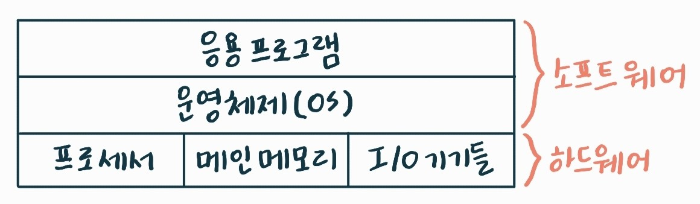
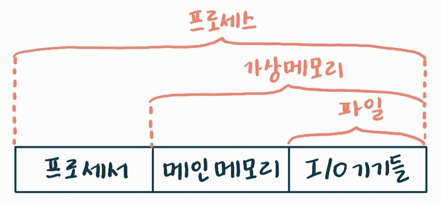
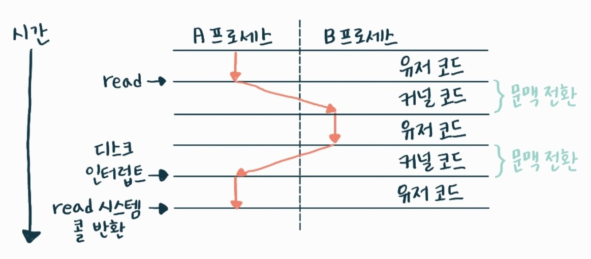
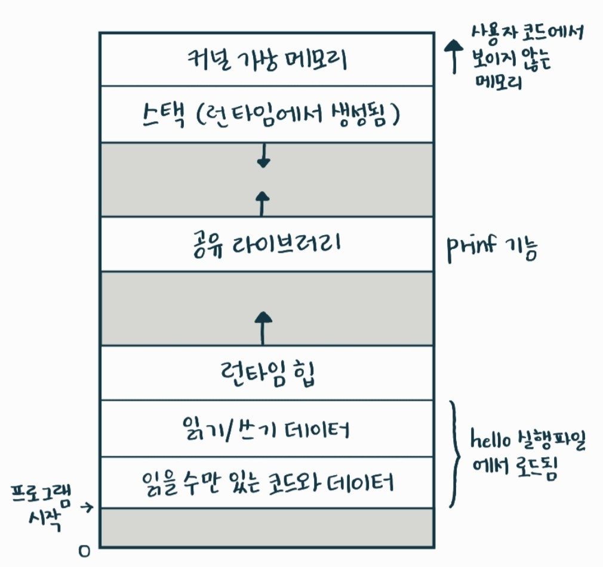

# 2025-03-25 : 알고리즘/컴퓨터 시스템

### 💡 오늘의 일정!

자소서만 쓴 날....22

1. 오전(10:00 ~ 12:00)
   
   - 자소서 쓰기
   - CSAPP 1-7

2. 오후(13:00 ~ 18:00)

   - 퀴즈  
   - 코어 타임
   - 알고리즘 문제 풀기
   
3. 저녁(19:00 ~ 23:00) 

   - 자소서 쓰기
   - 알고리즘 문제 풀기
  
## 💙 1. [CSAPP] Ch1. 컴퓨터 시스템으로의 여행
 
### 🔶 1.7 운영체제는 하드웨어를 관리한다.

#### 📌 기본 개념
- 응용 프로그램은 하드웨어를 직접 다루지 않는다.

- 대신 운영체제(OS)를 통해 CPU, 메모리, 디스크, 입출력 장치 등에 접근한다.

  > ✅ **예시: hello 프로그램 실행**
  > 
  > 쉘(Shell)이 hello 프로그램을 실행할 때,
  > 
  > hello는 키보드나 디스플레이에 직접 접근하지 않고,
  > 
  > 운영체제가 제공하는 시스템 콜을 통해 간접적으로 사용한다.

#### 📌 운영체제의 두 가지 주요 목적

1. 보호 (Protection)
 
   - 응용 프로그램이 하드웨어를 잘못 제어하지 못하게 보호한다.

   - 다른 프로그램의 메모리 침범 방지 등

2. 추상화 (Abstraction)

   - 복잡하고 다양한 하드웨어 장치를 단순하고 일관된 인터페이스로 제공한다.

   - 예: 파일, 프로세스, 가상메모리라는 개념을 통해 단순화

#### 📌 컴퓨터 시스템의 계층화

- **컴퓨터 시스템의 계층화 그림**
   
   

  - 소프트웨어는 하드웨어 위에 계층적으로 구성한다.
  - 응용 프로그램은 OS를 거쳐 하드웨어를 제어한다.

#### 📌 운영체제에 의한 추상화

- **운영체제에 의한 추상화**
  
   

- 운영체제가 프로세스, 가상 메모리, 파일이라는 추상 개념을 만들어낸다.

### 🔶 1.7.1 프로세스

#### 📌 프로세스란?

- 프로세스란 실행 중인 프로그램에 대한 운영체제의 추상화이다.

- 운영체제는 한 프로그램이 CPU, 메모리, 입출력장치 등을 혼자 사용하는 것처럼 착각하게 만들어준다.

- 실제로는 여러 프로그램이 동시에 실행되지만, 각각은 자신이 단독으로 하드웨어를 독점하고 있는 것처럼 보인다.

- 이 "환상"을 만들어내는 개념이 바로 프로세스이다.

#### 📌 동시 실행

- 최신 시스템에서는 여러 개의 프로세스가 동시에 실행될 수 있다.
- 이때의 "동시"란, 실제로는 아주 짧은 시간 간격으로 CPU를 프로세스 간에 빠르게 전환하면서 실행시키는 것
- 이걸 문맥 전환(Context Switch) 라고 부른다.
- 심지어 CPU 개수보다 더 많은 프로세스가 존재해도 운영체제는 이들을 교대로 실행시켜준다.
- 한 CPU에서도 여러 프로세스가 번갈아 실행되며, 멀티코어 시스템에서는 진짜로 병렬 실행도 가능하다.

  > ✅ **문맥 전환이란?**
  >
  > 현재 프로세스의 상태(PC, 레지스터 등)를 저장하고,
  >
  > 새로운 프로세스의 상태를 복원해 실행 전환하는 것이다.

#### 📌 프로세스 문맥전환

- **프로세스 문맥전환**
  

- 그림은 프로세스 A와 B가 문맥 전환하며 실행되는 모습을 시간 순서대로 보여준다.
- 중간에 read() 호출 후 디스크 인터럽트가 발생하여

  → 다른 프로세스(B)가 실행되었다가
  
  → 디스크 작업 완료 후 프로세스 A로 다시 복귀

- 이것이 바로 운영체제가 보여주는 프로세스 간의 동시성 시뮬레이션이다.
  
### 🔶 1.7.2 쓰레드(Thread)

#### 📌 쓰레드란?

- 쓰레드란 프로세스 안에서 실행되는 하나의 실행 흐름이다.

- 하나의 프로세스는 여러 개의 쓰레드를 가질 수 있음

#### 📌 쓰레드의 특징

- 같은 프로세스 컨텍스트를 공유하면서 실행된다:
  - 동일한 코드, 전역 데이터, 힙을 공유한다.
  - 하지만 각 쓰레드는 자신만의 스택과 레지스터 상태를 가진다.

#### 📌 쓰레드가 중요한 이유

1. 데이터 공유가 쉽다.
   - 같은 프로세서 내에서 동작하므로, 복잡한 IPC(프로세스 간 통신) 없이도 간단하게 데이터 공유 가능
2. 성능 효율성
   - 새로운 프로세스를 만드는 것보다 쓰레드를 생성하고 전환하는 것이 더 빠름
   - 문맥 전환이 더 가볍고 빠름
3. 멀티코어 활용
   - 여러 쓰레드를 서로 다른 CPU 코어에서 동시에 실행하면 병렬 처리 가능
    
     → 전체 프로그램의 실행 속도 향상
  
### 🔶 1.7.3 가상메모리

#### 📌 가상메모리란?

- 가상 메모리란 각 프로세스가 메모리를 자기 혼자 사용하는 것처럼 보이게 하는 OS의 추상화 기법이다.

- 실제로는 모든 프로세스가 메모리를 공유하지만, OS가 각자 고유 메모리를 갖는 것처럼 관리한다.

#### 📌 프로세스 가상 주소 공간
- **프로세스 가상 주소 공간**
  
  

- 각 영역은 역할이 다르며, 코드, 데이터, 힙, 스택 순서로 구성된다.

- malloc → heap 사용, 함수 호출 → 스택 사용

### 🔶 1.7.4 파일

#### 📌 파일이란?

- 파일은 OS가 제공하는 모든 I/O 장치의 추상화이다.
- 디스크, 키보드, 네트워크 등도 파일처럼 접근할 수 있다.

  > ✅ **예시**
  >
  > read()를 사용해 디스크 파일을 읽는 것과 키보드 입력을 받는 것은 비슷하게 처리된다.
  >
  > 이렇게 하드웨어 특성을 숨기고, 일관된 방식으로 프로그램이 장치를 사용할 수 있다.

## 💙 2. 알고리즘

오늘 푼 문제들은 다음과 같다. (우선순위 큐)

> 2493, 11866, 1655